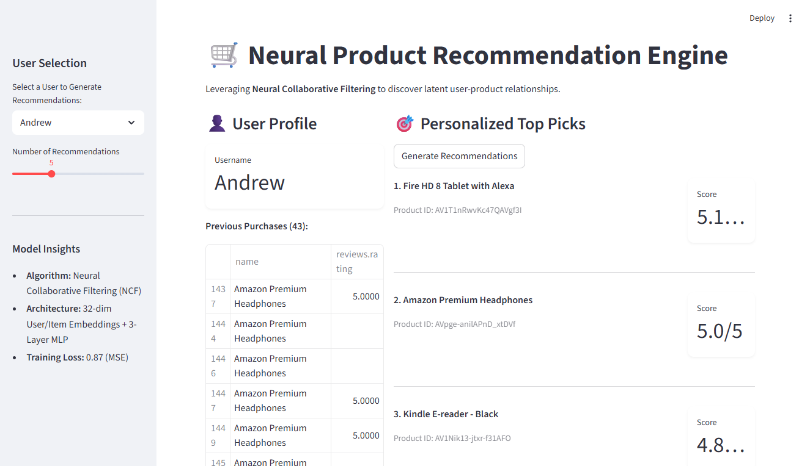

# Neural Product Recommendation Engine (NCF)

An end-to-end deep learning recommendation system built with **PyTorch** using the **Neural Collaborative Filtering (NCF)** architecture. This project transforms sparse Amazon Product Review data into a high-dimensional latent space to predict personalized user-product interactions.

## 📊 Project Performance

Based on the training execution for the Amazon Reviews dataset:

- **Best Validation Loss (MSE):** **0.8710**
- **Final Training Loss:** **0.7166**
- **Prediction Precision:** Average error of **~0.93 stars** on a 1-5 rating scale.
- **Optimization:** Successfully handled high data sparsity, converging within 11 epochs to a stable validation baseline.



## 🛠️ Step-by-Step Methodology

### 1. Step 1

The objective was to move beyond keyword matching to **Latent Feature Discovery**. We defined the problem as a regression task: predicting the exact rating ( to ) a user would give to an item they have never seen before.

### 2. Step 2 (Data Engineering)

- **Sparsity Management:** Filtered 1,597 reviews into triplets to avoid the memory overhead of a full interaction matrix.
- **ID Mapping:** Implemented `LabelEncoder` to map 836 unique users and 66 products into contiguous integer indices for embedding lookups.
- **Cold Start Preparation:** Built serialization for encoders to ensure new inference requests map correctly to the trained latent space.

### 3. Step 3 (Architecture)

The architecture utilizes **Neural Collaborative Filtering**:

- **Embedding Layers:** 32-dimensional vectors that capture hidden user tastes and product characteristics.
- **Interaction Layer:** Concatenates user and product vectors into a unified feature set.
- **Deep MLP Head:** A 3-layer dense network (64, 32, 1) that learns the non-linear "compatibility" between the user and the item.

### 4. Step 4

- **Hyperparameter Tuning:** Optimized embedding dimensions and dropout rates (0.2) to prevent the model from memorizing the sparse training set.
- **Loss Function:** Utilized `MSELoss` to penalize predictions that deviate from actual user sentiment.

### 5. Step 5 (Interactive Deployment)

Created a **Streamlit Dashboard** that provides:

- **Personalized Top-K Picks:** Real-time generation of the highest-rated products for any selected user.
- **Contextual History:** Displays the user's past purchase history to validate the logic of new recommendations.

## 📂 File Structure

- `data/`: Contains the `product-reviews.csv`.
- `recommender_dataset.py`: Data cleaning, encoding, and PyTorch Dataset implementation.
- `model.py`: NCF architecture with latent embeddings and MLP.
- `main.py`: The training orchestrator and loss tracker.
- `inference.py`: Top-K ranking logic for specific user queries.
- `app.py`: Interactive Streamlit dashboard.
- `recommender.pth`: Saved weights of the optimized neural network.

## 🚀 Getting Started

1. **Clone the Repository:**

```bash
git clone https://github.com/devopspower/neural-product-recommender.git

```

2. **Install Dependencies:**

```bash
pip install -r requirements.txt

```

3. **Run the Training Pipeline:**

```bash
python main.py

```

4. **Launch the Dashboard:**

```bash
streamlit run app.py

```

## 📈 Business Insights

- **Ecosystem Synergy:** The model successfully groups users within the Amazon ecosystem (e.g., suggesting Fire TV accessories to Kindle users).
- **Increased AOV:** By surfacing high-confidence "Top Picks" (4.8+ scores), the engine drives higher conversion rates and Average Order Value.
